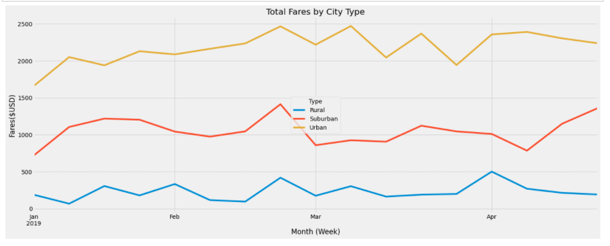

# PyBer_Analysis
PyBer_Analysis

## Overview of the analysis:

The overview of this analysis is to create a summary DataFrame of the ride sharing data by city type. Then we used pandas and Matplotlib to create a multipule-line graph that shows the total weekly fares for each city type. Then we are to summarize how the data differs by city type and how those differences can be used by PyBer to make decision at the company.

## Results:
There is several differences amongst the ride sharing data in the different city types. If you look at the examples below you see how the amount of riders and drives differ per city type.  

In a Rural city as you see here, it's represented with lower drivers and rides but with much higher fare per driver and a higher fare per rider. Which means we can assume that with a lower ride amount the price per fare will go up in cost.
In an Urban city the amount of rides and drivers are much higher than in the Rural city and the fares are also much lower in price. This means we can assume that with more riders each rider in the city will have a lower fare per ride.
The Suberban city is right in the middle of both types of cities but still has a lot more drivers and riders than Rural cities. 

## Summary:

In this analysis I would give mulipule inputs about possible things that could increase productivity or even prove to be an impact on the business. 
I would suggest that an impact that we don't see in the current data is that during the winter in rural cities that it will be more difficult to recieve riders due to the conditions in the road and so you can expect a decrease in rider fare and an increase in driver fare which would add to more of a loss to the company.
In a larger area like the urban cities to increase productivity; incentive programs to increase driver count would be a good idea which would ultimately increase rider count. 
Lastly I would keep an eye of deman to supply to increase or slow down the driver demand in all city types as population and inflation consistanly impact data. 

